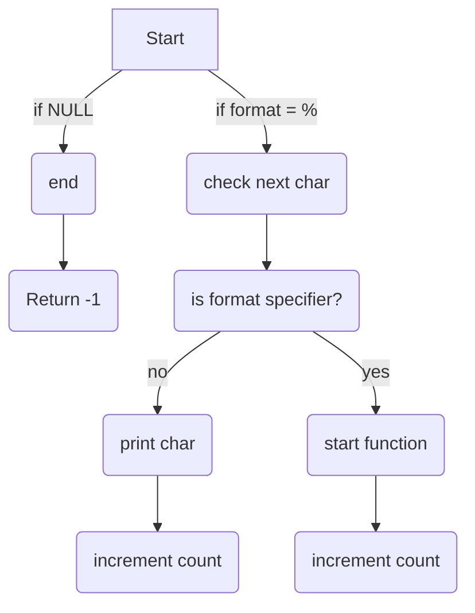

**_printf project**
---
**_printf**
This is our custom version of printf function, it can print characters, string and numbers with these function calls.

* `%c` : print a single character.
* `%s` : print a string.
* `%%` : print a percent.
* `%d` : print decimal.
* `%i` : print an integer.


**Flowchart**
---


**EXAMPLES**
---

```c
#include "main.h"
int main()
{
_printf("String: %s\n", "School");
_printf("Decimal: %d\n", 745);
return(0);
}
