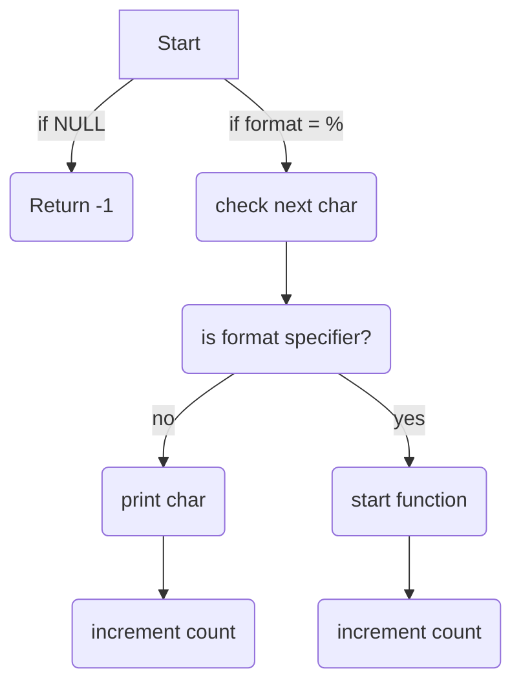

# holbertonschool-printf

Flowchart

```mermaid
flowchart TD
A[Start] -- if NULL --> B(Return -1)
A -- if format = % --> C(check next char)
C --> D(is format specifier?)
D -- no --> E(print char)
D -- yes --> F(start function)
E --> G(increment count)
F --> H(increment count)

```
