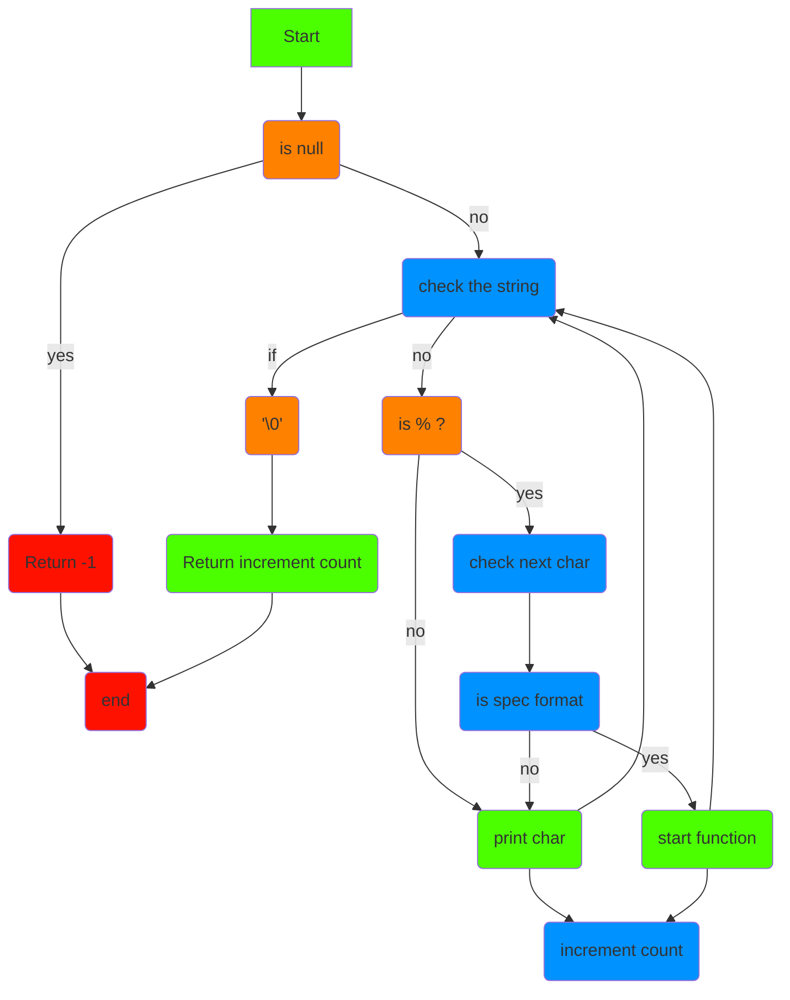

# **PRINTF Project**
  
**_printf**
---
This is our custom version of printf function, it can print characters, string and numbers with these function calls.

* `%c` : print a single character.
* `%s` : print a string.
* `%%` : print a percent.
* `%d` : print decimal.
* `%i` : print an integer.


**Flowchart**
---



**EXAMPLES**
---

```c
#include "main.h"
int main()
{
_printf("String: %s\n", "School");
_printf("Decimal: %d\n", 745);
return(0);
}

```
**OUTPUT**
---
```c
String: School
Decimal: 745

```

**Compilation**
* `gcc -Wall -Werror -Wextra -pedantic -std=gnu89 -Wno-format *.c`

**Main folder to test**
```c
#include <limits.h>
#include <stdio.h>
#include "main.h"

/**
 * main - Entry point
 *
 * Return: Always 0
 */
int main(void)
{
	int len;
	int len2;
	unsigned int ui;
	void *addr;

	len = _printf("Let's try to printf a simple sentence.\n");
	len2 = printf("Let's try to printf a simple sentence.\n");
	ui = (unsigned int)INT_MAX + 1024;
	addr = (void *)0x7ffe637541f0;
	_printf("Length:[%d, %i]\n", len, len);
	printf("Length:[%d, %i]\n", len2, len2);
	_printf("Negative:[%d]\n", -762534);
	printf("Negative:[%d]\n", -762534);
	_printf("Unsigned:[%u]\n", ui);
	printf("Unsigned:[%u]\n", ui);
	_printf("Unsigned octal:[%o]\n", ui);
	printf("Unsigned octal:[%o]\n", ui);
	_printf("Unsigned hexadecimal:[%x, %X]\n", ui, ui);
	printf("Unsigned hexadecimal:[%x, %X]\n", ui, ui);
	_printf("Character:[%c]\n", 'H');
	printf("Character:[%c]\n", 'H');
	_printf("String:[%s]\n", "I am a string !");
	printf("String:[%s]\n", "I am a string !");
	_printf("Address:[%p]\n", addr);
	printf("Address:[%p]\n", addr);
	len = _printf("Percent:[%%]\n");
	len2 = printf("Percent:[%%]\n");
	_printf("Len:[%d]\n", len);
	printf("Len:[%d]\n", len2);
	_printf("Unknown:[%r]\n");
	printf("Unknown:[%r]\n");
	return (0);
}
```

## Authors
* Alexis B.
* Killian R.
